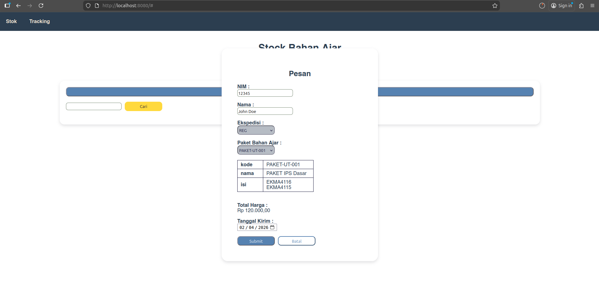
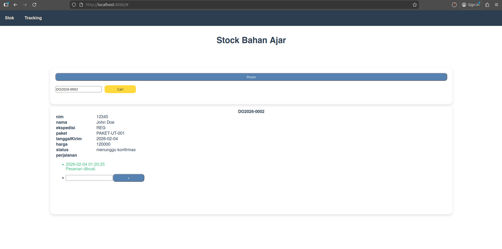
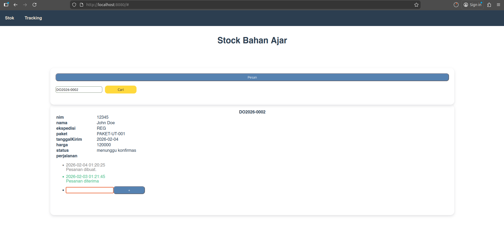

# College Materials Management Interface VueJS

This is college assignment. In this assignment we got a task to make a college material interface to show the material module list and make an order.

1. Module List (Filtering and Sorting)
    

2. Add order
    

3. Added order
    

4. Add tracking checkpoint
    

## Project setup
```
npm install
```

### Compiles and hot-reloads for development
```
npm run serve
```

### Compiles and minifies for production
```
npm run build
```

### Lints and fixes files
```
npm run lint
```

### Customize configuration
See [Configuration Reference](https://cli.vuejs.org/config/).
